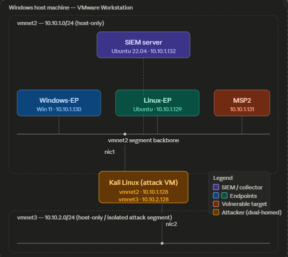

 # Virtual Machine/Environment Configuration

 ## Network Topology
 This lab environment utilizes two virtual networks for simulation. Vmnet2 is configured to simulate a small-scale corporate environment with both Linux and Windows endpoints. This subnet also contains an Ubuntu server instance that runs the SIEM server and a Metasploitable instance to simulate a misconfigured host machine.

 Vmnet3 is an isolated attack network that solely contains a Kali Linux instance to simulate malicous activity from an external network.

 

 ## VM Specifications
 | Name | VM | Disk | RAM | 
 |---|---|---|---|
 | SIEM | Ubuntu Server 22.04 | 80GB | 8GB |
 | Windows-EP | Windows 11 | 50GB | 4GB |
 | Linux-EP | Ubuntu | 20GB | 2GB |
 | MSP2 | Metasploitable 2 | 8GB | 512MB | 
 | Kali | Kali Linux | 40GB | 8GB |

 ## IP Table
 | Name | Network | Address |
 |---|---|---|
 | SIEM | vmnet2 (host-only) | 10.10.1.132 |
 | Windows-EP | vmnet2 (host-only) | 10.10.1.130 |
 | Linux-EP | vmnet2 (host-only) | 10.10.1.129 |
 | MSP2 | vmnet2 (host-only) | 10.10.1.131 |
 | Kali | vmnet2 (host-only) | 10.10.1.128 |
 | Kali | vmnet3 (host-only) | 10.10.2.128 |