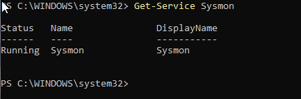
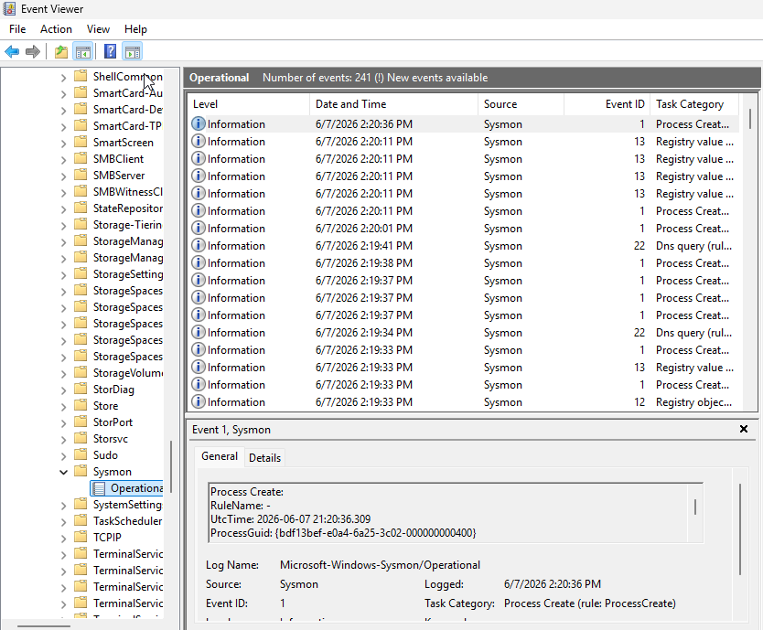
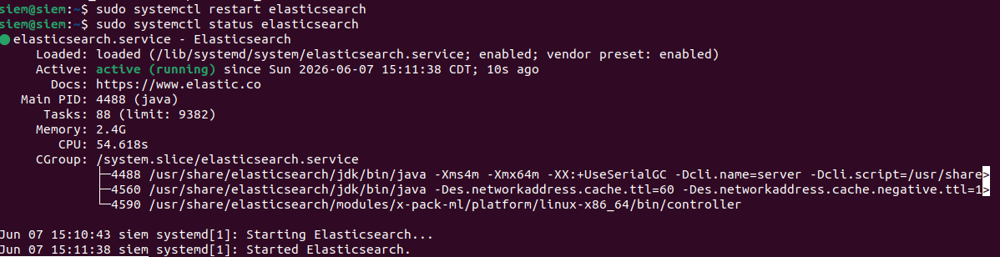
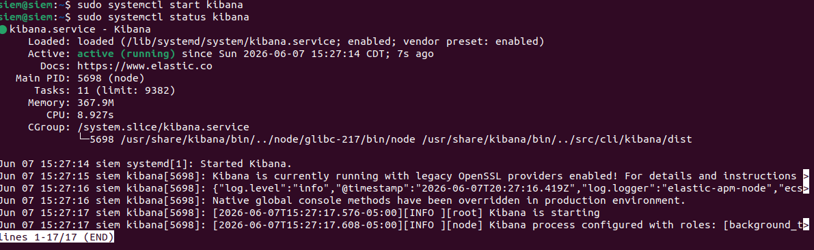

# Elastic Setup Process Documentation
This documentation showcases the process of the SIEM environment configuration conducted within the Windows-EP and SIEM virtual machines. The configuration is broken into two main sections. The first section focuses on the install/config of Windows Sysmon on Windows-EP and section two will show how the Elastic stack was configured on the SIEM VM server. At the end of each section/subsection the commands used will be shown in a table. 

Note: Sections of the environment setup required the machines to have internet access for either website access or APT installs. Since the machines are running on a host-only network, the network adapters were temporarily switch to NAT for install steps and switch back to Vmnet2 once complete.

## Part 1: Windows Sysmon Configuration
1. On Windows-EP, Sysmon and the SwiftOnSecurity config file were downloaded and saved to a dedicated tools folder (C:\Tools\Sysmon).

    [Sysmon Download](learn.microsoft.com/en-us/sysinternals/downloads/sysmon)
    
    [SwiftOnSecurity Config](raw.githubusercontent.com/SwiftOnSecurity/sysmon-config/master/sysmonconfig-export.xml)

2. Using a PowerShell instance as administrator in the C:\Tools\Sysmon directory, Sysmon was installed with the SwiftOnSecurity config as shown below.

    

    Sysmon log generation was also confirmed within the Windows Event Viewer.

    
    
    | Command | Use |
    |---|---|
    | .\Sysmon.exe -accepteula -i sysmonconfig-export.xml | Install script for Sysmon |
    | Get-Service Sysmon | Verifies that Sysmon is running |

## Part 2: Elastic Stack Installation
1. **Elastic Repository Addition**

    On the SIEM VM, the Elastic repository was added to the system so that Elastic, Kibana, and Logstash can be installed using APT using the following commands.

    | Command | Use |
    |---|---|
    | wget -qO - https://artifacts.elastic.co/GPG-KEY-elasticseach \| sudo --dearmor -o /usr/share/keyrings/elasticsearch-keying.gpg | Grabs the Elastic GPG key for   package verification |
    | echo "deb [signed-by=/usr/share/keyrings/elasticsearch-keyring.gpg]   https://artifacts elastic.co/packages/8.x/apt stable main" \| sudo tee   /etc/apt/sources.list.d/elastic-8.x.list | Adds the Elastic Repository |
    | sudo apt update | Updates packages |

2. **Elasticsearch Installation**
 
    After adding the Elastic repository, Elasticsearch was installed and configured. Elasticsearch generates a superuser password upon installation which was saved and stored in a safe location.

    - Once Elasticsearch was installed, elasticsearch.yml was edited to set the following fields:

        - network.host: 10.10.1.132
        - http.port: 9200
        - cluster.name: soc-homelab
        - node.name: siem-node-1
    
    - The Elasticsearch service was then enabled, started, and verified to be running.

        

    | Command | Use | 
    |---|---|
    | sudo apt install elasticsearch -y | Installs Elasticsearch Package |
    | sudo nano /etc/elasticsearch/elasticsearch.yml | Edit the Elasticsearch configs |
    | sudo systemctl enable elasticsearch   sudo systemctl start elasticsearch| Enables/Starts Elasticsearch service |

3. **Kibana Installation**

    The installation process for Kibana is very similar to the Elasticsearch install, with only some minor changes to what fields are changed during the initial configuration.

    - After installation, the following fields were set in kibana.yml:

        - server.port: 5601
        - server.host: "10.10.1.132"
        - elasticsearch.hosts: ["https://10.10.1.132:9200"]

        

    | Command | Use |
    |---|---|
    | sudo apt install kibana -y | Installs Kibana Package |
    | sudo nano /etc/kibana/kibana.yml | Edit Kibana Configs |
    | sudo systemctl enable kibana   sudo systemctl start kibana | Enables/Starts the Kibana Service |